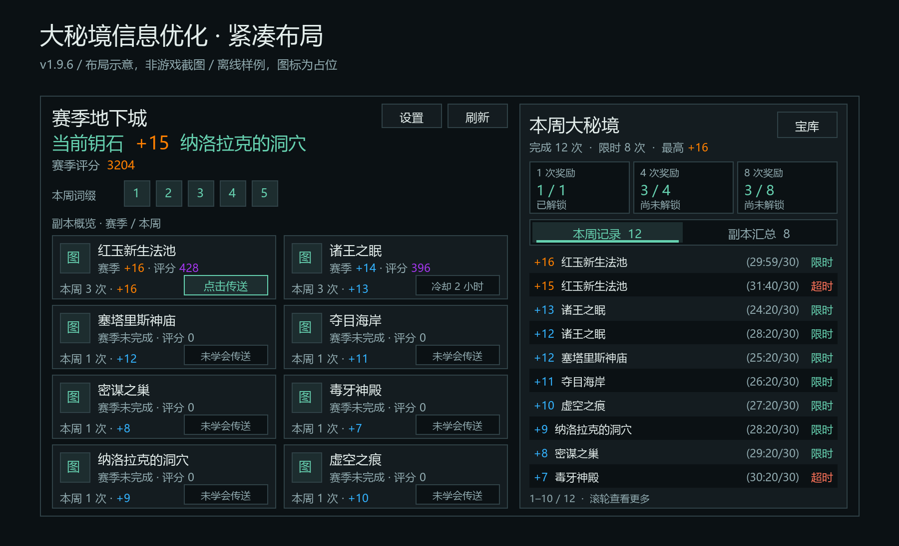
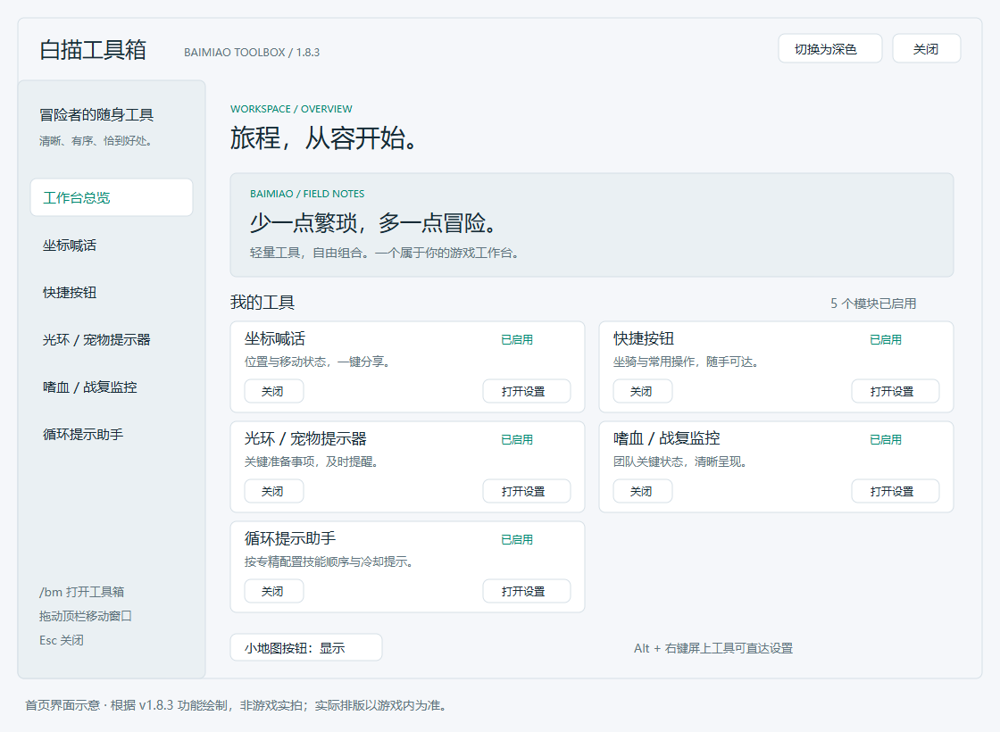
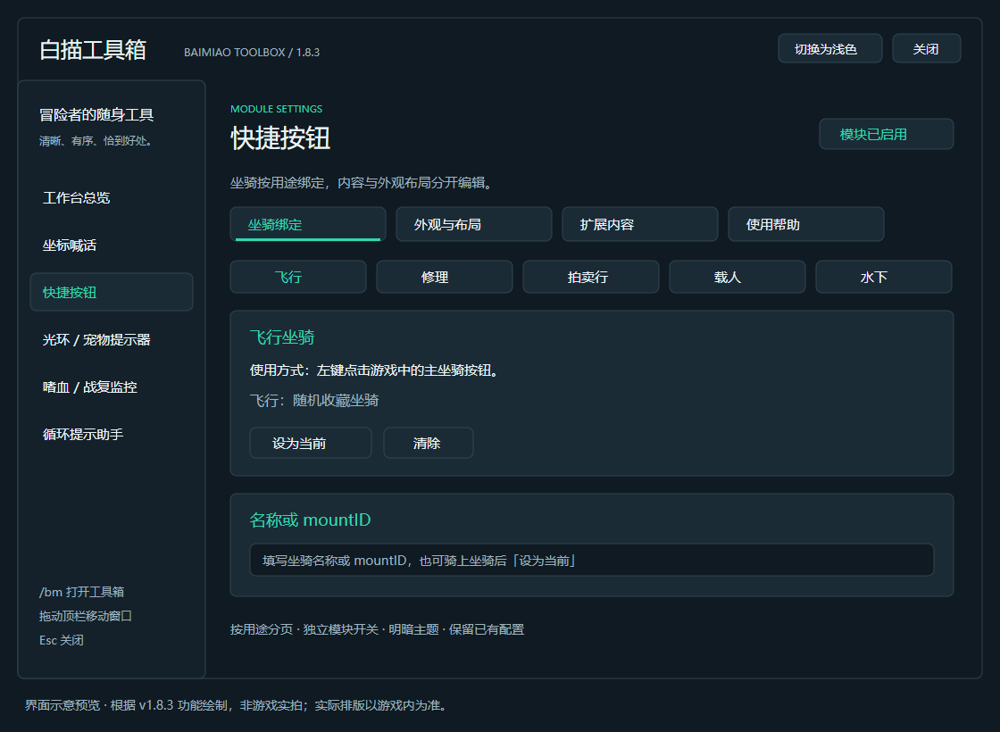
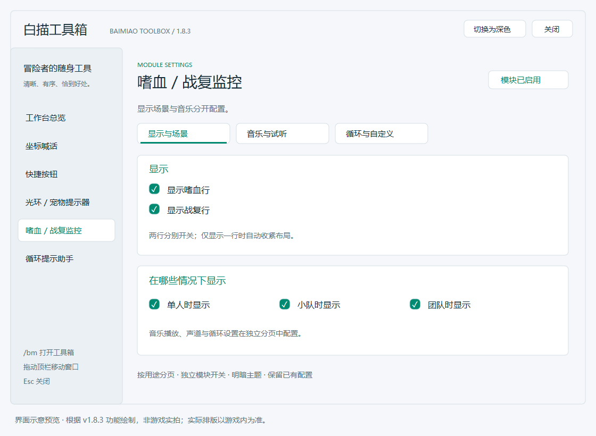

# 白描工具箱 | BaimiaoToolbox

魔兽世界（零售版 12.x）个人小工具合集。每个功能都是独立模块，可在 **`/bm` 独立工作台** 中单独开关，也支持系统设置入口和小地图按钮快速进入。

## 1.9.8：嗜血出本状态与最佳队伍

嗜血备用计时只在副本内生效，出本立即清除；过图旧疲惫晚加载不再凭公开旧时间误触发。保留 1.9.7 已确认能响的音乐触发，声音和声道不变。无声或状态异常可用 **`/raidcd music`** 诊断；[机制、限制与测试](docs/raid-music.md)。

本周记录 / 汇总优先取本周最佳队伍。首选只有本人、另一份最佳有队友时，整条回退并保留正确来源；不拼接不同场次。两份都只有一人时注明“仅1人资料”，可先悬停目标再输入 **`/bmmp team`** 查看公开名单数量。窗口布局沿用 1.9.6。

**已知限制**：用户诊断中，本周最佳与赛季限时最佳均只提供本人资料，另一场赛季超时最佳有 5 人。本版在该情况下保留原本的最佳记录，不为凑齐名单改选那场超时记录；限时最佳的其他队员尚无法从现有返回中恢复。

## 大秘境信息优化（1.9.6）

第六个独立模块。在 **`/bm` → 大秘境信息优化** 设置，默认启用；打开系统 **史诗钥石地下城** 页签即可使用。

- **1.9.1 修正**：消除底部原生副本图标露出，修复传送按钮检测和图层、PvP 切页宽度；突出当前钥石，精简评分文字，按游戏规则区分层数与评分颜色。
- **1.9.6 布局与状态**：窗口收紧为 840×462，移除页脚留白，左右底线对齐、外框内收；右侧采用带选中底色 / 下划线 / 数量的分段栏。未学会、冷却、未知、关闭、战斗均显示状态框，只有就绪时才显示可施放按钮。
- **1.9.5 提示整理**：最佳成绩与队员双列对齐，保留职业色，移除日期、词缀和重复摘要；传送按钮仅显示状态，页面与设置删除长说明。
- **1.9.4 提示与精简**：卡片非按钮区域不再提示“点击传送”；兼容设置仅保留隐藏旧看板开关和刷新数据按钮。
- **1.9.3 视觉细化**：最佳队伍姓名按职业染色，职业 / 专精保持柔和；“设置”“刷新”在顶部并排相邻放置。
- **1.9.2 紧凑与详情**：默认窗口 840×494，占用面积减少约 25%；本周记录显示 `(25:24/32) 限时`，提示跟随鼠标并显示用时、评分和明确标注的最佳队伍（姓名 / 职业 / 专精），不逐条匹配历史队友。
- **统一布局**：钥石、评分、词缀、两列副本卡片及本周看板放在同一个窗口，跟随工作台明暗主题；支持缩放和隐藏右侧看板。
- **独立看板**：当前角色的本周记录、按副本汇总、最高层数、限时状态及游戏返回的地下城宝库进度；不依赖 EUI_Kogotool，也不保存跨周历史。
- **副本与传送**：赛季成绩与本周成绩分开标注，支持排序、翻页；手动点击已学会的副本传送，标明未学会、未知映射、冷却与战斗状态。
- **兼容与恢复**：AngryKeystones 开关均可使用；默认临时隐藏 Kogo 旧本周面板，不修改其设置。关闭本模块后恢复原页签与尺寸，战斗中延后处理。
- **易用设置**：显示与布局 / 副本与传送 / 兼容与刷新三个分页；页签内提供设置、刷新和宝库入口。

> 本模块重绘此页内容，不显示 AngryKeystones 的预测词缀日程，不影响它的副本计时等其它功能。首次从旧版升级新增模块时请完全退出并重新进入游戏；从 1.9.0–1.9.7 升级到 1.9.8 可覆盖后 `/reload`。离线检查不代替游戏内的渲染、战斗安全和插件组合验证。



[使用说明、数据边界与游戏内测试清单](docs/mythicplus.md)

## 既有界面预览

> 以下为根据 v1.8.3 功能绘制的**界面示意图，并非游戏截图**。展示明暗主题与分页组织（旧首页包含五个模块）；实际字体、间距和状态以游戏内为准。

### 首页 · 工作台总览


### 深色 · 快捷按钮


### 浅色 · 嗜血 / 战复监控


## 坐骑与监控修正（1.8.3）

- 水下、修理、拍卖行、载人用途：优先手动绑定，其次自动候选；无候选或绑定坐骑未收藏时提示设置，不再随机召唤不符合用途的坐骑。飞行用途仍可使用随机收藏坐骑。
- `/bm` → **嗜血 / 战复监控 → 显示与场景**：分别勾选「显示嗜血行」「显示战复行」。仅显示一行时自动收紧布局，两行都关闭时不显示监控框。
- 行显示开关不代替音乐开关；音乐仍在「音乐与试听」页独立控制。场景开关仅控制监控框，不影响音乐检测。

## 快捷按钮交互优化（1.8.2）

- 控制钮平时隐藏，鼠标悬停主坐骑图标时显示；移开后延迟 0.45 秒隐藏，移到控制钮上可继续操作。
- 使用主坐骑图标外的 **「展开 N / 收起 N」** 文字按钮，点击区域为 80×26，随快捷按钮缩放。
- 横向扩展时控制钮固定在主图标上方，纵向扩展时固定在右侧，不覆盖坐骑图标，折叠时也不移动。
- **中键点击主坐骑图标**同样可以切换，不会召唤坐骑；原左键、右键坐骑操作不变。
- 战斗中显示 **「待展开 / 待收起」**，脱战后自动执行；再次点击可取消等待。不会在战斗中修改安全按钮的显示或宏属性。
- 没有扩展条目或关闭扩展功能时，不显示控制钮；保留已有配置和明暗主题。

## 原有功能设置重整（1.8.0）

通过 `/bm` 左侧选择功能，设置改为按用途分组的 Tab，选中页带主题色下划线。

| 功能 | 设置分组 |
| --- | --- |
| 坐标喊话 | 屏幕显示 / 通报模板 / 变量帮助 |
| 快捷按钮 | 坐骑绑定 / 外观与布局 / 扩展内容 / 使用帮助 |
| 光环 / 宠物提醒 | 提醒规则 / 外观与测试 / 高级识别 |
| 嗜血 / 战复监控 | 显示与场景 / 音乐与试听 / 循环与自定义 |

- **坐骑绑定按用途切换**：飞行、修理、拍卖行、载人、水下各自一页；显示对应鼠标组合键、当前绑定、设为当前及清除操作。
- **常用与高级选项分开**：提醒文字和触发时机放在前面，法术 ID 列表收进高级页；嗜血音乐的试听与循环参数分开。
- **编辑与布局分开**：扩展按钮的内容、检查配置、示例在同一页，方向、短名、折叠在外观页；使用帮助常驻可读，不必只靠悬停。
- **区分测试与真实操作**：坐标的发送按钮明确标注真实喊话，提醒器测试仅本机显示 3 秒，音乐试听仅本机播放。
- 坐标及快捷按钮的缩放统一显示为百分比，底层仍使用原来的倍率配置，不清空已有设置。
- 五个模块共用分页组件，切页不重建输入框，主题和战斗保护沿用原工作台；循环助手功能保留。

本次只重整原四模块的设置构建与操作说明，不改变坐骑安全执行、提醒触发或监控逻辑。更新后 `/reload` 即可。
离线测试覆盖分页切换、坐骑槽独立性、倍率兼容及既有循环助手；仍需在游戏内验证排版和实际操作。

## 循环提示助手（1.7.1）

在「显示与布局」中：
- 可勾选 **锁定后隐藏背景与边框**，保留技能图标、冷却和文字，解锁后恢复背景；默认关闭以保留现有外观。
- **整体缩放（%）** 支持 50%–200%，默认 100%，图标、文字、冷却数字与间距一起缩放；原有图标大小仍可单独调整。


- **面向所有职业专精**：屏幕上自动显示当前角色专精的已勾选方案，切换专精立即切换显示；尚未选择专精时不显示。
- **按职业 → 专精编辑**：方案编辑页先选职业和专精，每个专精独立拥有 6 套方案。可编辑其他职业，编辑选择不会改变实际显示对象；可一键回到当前角色专精。
- **预设归属**：素材中的三套惩戒骑顺序仅作为惩戒专精预设，其他专精为空，不会显示骑士技能或猜测循环。
- **旧版迁移**：旧六套完整保存在惩戒档及只读迁移备份；若升级时当前非惩戒专精，修改过的非空顺序也复制到当前专精。可用「从旧版恢复到空方案槽」将旧内容填入所选专精对应的空槽，不覆盖已有内容。
- 外观设置全局共用，卡片位置仍按角色及槽位记忆；旧版的仅惩戒显示开关不再生效。
- 此处的天赋匹配按**职业专精**区分（如神圣、惩戒）；同一专精的不同天赋配装共用该专精的六套方案。


设置分为 **显示与布局 / 方案编辑 / 写法帮助** 三个 Tab；方案编辑内再切换六套方案，每次只显示一套编辑器。
未锁定时可点击卡片右上角 `x` 隐藏单条（不删除配置），悬停技能图标查看游戏技能提示，也能从图标直接拖动整条。
锁定后关闭按钮隐藏、技能悬停停用，保留完整鼠标穿透。需要重新显示时，在对应方案页重新勾选即可。

输入 `/bm rotation`（或 `/bmrotation`），在方案编辑页选择职业与专精，再勾选需要显示的方案。新建专精默认不勾选任何方案，避免更新后遮挡画面。

- 内置素材中的惩戒骑单体、AOE 第一套、AOE 第二套技能顺序，不带攻略说明文字。
- 每个专精的六套方案均可改名、编辑和独立显示，支持所有职业。
- 取消「锁定卡片位置」后分别拖动，重新锁定后鼠标穿透；位置按角色保存。
- 支持图标大小、换行、背景透明度、技能名称与方案标题开关，跟随工作台明暗主题。
- 默认显示实时冷却圈和原生倒计时；可读取的充能层数在右上角，配置次数在右下角。可关闭冷却显示。
- 12.x 优先使用原生 DurationObject 绘制，受限数值不会参与计算；API 不可用时可能不显示冷却/充能数字。不在冷却不等于满足资源、距离等施放条件。
- 固定参考顺序，不自动推荐下一招，不自动施法，也不会根据已施放技能推进或隐藏图标。

配置写法（技能 ID 或游戏完整技能名）：

```text
20271 > 184575 > 31884 + 255937 > 343527 > 383328 > 375576 > 383328
审判 > 公正之剑 > 复仇之怒 + 灰烬觉醒
383328 + 53385*1-2
```

`>` 分隔步骤，`+` 表示同一步的组合，`*1-2` 仅表示次数范围。每套最多 24 个图标。
修改后点击保存；无法识别的技能显示问号，语法错误的方案暂不显示，保留输入供修正。
冷却跟随技能事件更新；配置仅限脱战操作，提示卡片战斗中仍显示。

更新后 `/reload`，若新增模块未加载，请完全退出并重新进入游戏。
开发检查：`python -m unittest discover -s tests -p "test_*.py"`，需要开发依赖 `lupa`；离线测试不代替游戏内验证。

## 新版工具箱界面（1.5.0）

- **独立工作台**：输入 `/bm` 或左键点击小地图按钮打开；系统「设置 → 白描工具箱」也保留入口。
- **首页工具卡片**：集中查看各个模块的启用状态，直接进入设置或启停功能。
- **左侧导航 + 分组设置**：统一标题、卡片、按钮、输入框与细滚动条，长说明自动折行。
- **明暗主题**：右上角切换深色 / 浅色，主题按角色记忆；无需重载。
- **窗口布局**：拖动顶栏移动，按角色保存位置；按屏幕可用空间自动缩放，`Esc` 关闭。
- **战斗保护**：战斗中不能打开配置；已经打开的设置会被遮罩锁定，脱战后恢复。游戏中的坐骑 / 快捷动作按钮仍使用原来的安全执行逻辑。

本次调整设置界面，不更改四个模块的业务逻辑、原有配置字段及屏上工具的位置。
新增 `workspace` 角色偏好，仅记录工具箱主题与窗口位置。没有额外的游戏运行依赖。

### 本地验证建议

安装更新后先 `/reload`，再输入 `/bm`。若游戏仍使用旧的文件清单或未加载新窗口，退出游戏并重新登录。
重点检查：首页五张卡片、两套主题、各模块长页面滚动、输入框保存、滑块取值与战斗遮罩。
开发侧执行 `python tests/test_workspace.py`（需要开发依赖 `lupa`），仅模拟 WoW UI API 做 Lua 5.1 构建和交互检查，不代替游戏内渲染与安全环境验证。

## 功能

### 📍 坐标喊话
屏上显示当前坐标 / 移速 / 到目标的距离区间，点一下按模板把坐标通报到频道。
- 模板完全自定义（`{coord}` `{target}` `{range}` `{speed}` `{hp}` 等变量，空变量自动省略）
- 通报前可在脚下落地图路点，喊话自带可点击的路点链接
- 12.x “秘密值”兼容：敌对目标血量/移速/目标名读不到时自动省略，不会报错
- 命令：`/coord`、`/cs`

### 🐎 快捷按钮（原“快捷坐骑”）
一个按钮按修饰键召唤不同用途的坐骑，图标随修饰键实时变化。
- 左键：飞行（未设置则随机收藏坐骑）　Shift+左键：修理
- Ctrl+左键：拍卖行　Alt+左键：载人　右键：水下
- 各用途可“骑上想要的坐骑 → 设为当前”一键绑定，也可以直接填坐骑名或 mountID（填错会在设置页标红）
- 扩展按钮：在设置里每行输入一条技能/玩具/物品的 ID 或名称（如 `技能:460905`、
  `玩具:奥术秘社的私人钥匙`），按钮会按选定方向（上/下/左/右，默认向右）长在主坐骑
  按钮旁，尺寸与主按钮一致、缩放跟随，带冷却圈与悬停提示，点击直接使用
- 扩展按钮也能放快捷动作：`小退`（回角色选择）、`退组`、`重载界面`、`退出游戏`
- 自带逐行体检：设置里点「检查配置」或输入 `/qm check`，会告诉你每行认成了什么、哪行没识别；
  想换动作图标就在动作名后加 `@图标ID`（如 `退组 @135824`）。设置里的说明/诊断都是**悬停提示框**，
  不会往聊天频道刷字（只有你自己敲命令时才输出到聊天框）
- 按钮下方可显示短名（默认 2 字、截断不加省略号、上限可调；行尾 `#银行` 可自定义），多了不用悬停也能分辨
- 展开 / 收起：有扩展按钮时，主按钮生长方向那条边上会出现一个小箭头，点它可一键收起 / 展开那排按钮
  （只藏按钮、不清配置）；也可在设置里勾「收起扩展按钮」，或用 `/qm collapse`、`/qm expand`、`/qm toggle`
- 每个用途的坐骑也能直接填名字或 mountID，不必先骑上再抓取
- 扩展按钮走安全按钮（SecureActionButtonTemplate）执行，战斗中也能点；配置在战斗中改动
  会挂起、脱战后自动生效；玩具写“使用法术 ID”时会按同名玩具自动识别
- 命令：`/qm`

### ⚠️ 光环 / 宠物提示器
屏幕中央大字提醒，漏了关键准备事项时第一时间看见。
- 术士 / 猎人没带宠物（射击专精不带宠物属正常，默认豁免；“独来独往”法术 id 可在设置里维护）
- 骑士没开光环（法术 id 可按版本自行维护）
- 提醒文字 / 颜色 / 字号 / 闪烁全部可配置，锁定时不挡点击
- 命令：`/remind`（`lock` / `unlock` / `test` / `auras`）

### ⏱️ 嗜血 / 战复监控
两行小图标常驻：嗜血状态（准备就绪 / 嗜血中 / 冷却倒计时）与战复剩余次数。
- 团队读共享战复池，单人/小队读自己职业的战复（没有战复的职业显示「战复：无」，不误报 1 次）
- 可选嗜血触发音乐：支持 LibSharedMedia 声音与自定义路径，声道 / 循环可选
- 大秘境备用检测：仅副本内使用本机新获得的公开疲惫，推定计时明确显示“约”；出本、死亡、疲惫移除或到期停止，不读取秘密字段
- 命令：`/raidcd`、`/xuebiao`；无声诊断：`/raidcd music`

## 快捷按钮 · 示例配置（可直接复制）

设置路径：**`/bm` → 快捷按钮 → 扩展内容**（先勾选「显示扩展按钮」；生长方向默认向右）。

### 扩展按钮：每行一条

```text
-- 每行一条；以 -- 开头是注释、空行会被忽略
玩具:奥术秘社的私人钥匙 #钥匙
技能:460905
玩具:216665 #银行
物品:5512
小退
退组
```

### 写法速查

| 写法 | 含义 |
|---|---|
| `技能:460905`、`技能:炉石` | 施法（ID 或名称；**省略前缀时纯数字按 技能→玩具→物品 依次识别**） |
| `玩具:216665`、`玩具:奥术秘社的私人钥匙` | 用玩具（名称要与玩具箱里**完全一致**） |
| `物品:5512` | 用背包里的物品 |
| `小退`、`退组`、`重载界面`、`退出游戏` | 快捷动作（受保护动作，交给安全按钮执行）；也可写成 `动作:小退` |
| `退组 @148416` | `@` 后跟法术或物品 ID（如 `@148416`、`@5512`），换成那个法术/物品的图标 |
| `玩具:216665 #银行` | `#` 后面是这个按钮**下方显示的短名**（不写就按设置里的「短名字数上限」自动截断） |

> 小提示：网上的玩具 ID 常常是它的「使用法术 ID」（战团银行距离抑制器＝法术 `460905`，玩具物品 `216665`），
> 这种会自动按**同名玩具**识别，不会点了没反应。

### 各用途坐骑：也可以直接填名字或 mountID

```text
鎏金雷龙
```
或者骑上目标坐骑后点对应用途的「设为当前」抓取；填错名字会在设置页标红提示。

### 相关命令

| 命令 | 作用 |
|---|---|
| `/qm check` | 逐行体检扩展按钮配置：哪行认成了什么、哪行没识别 |
| `/qm help` | 在聊天框打印完整写法 |
| `/qm diag` | 控件自检（字体 / 阴影 / 行距 / 文本，排查显示异常） |
| `/qm fly`、`/qm repair`、`/qm ah`、`/qm passenger` | 直接召唤对应用途坐骑 |
| `/qm set <用途>`、`/qm clear <用途>` | 把当前坐骑设为该用途 / 清除绑定 |

## 安装

1. 打开 [最新 Release](https://github.com/Lianzy-Baimiao/BaimiaoToolbox/releases/latest)，下载 **附件** `BaimiaoToolbox-X.Y.Z.zip`（当前版本：`BaimiaoToolbox-1.9.8.zip`）。

   > ⚠️ 别下页面上的 **Source code (zip)**：那是源码包，解出来一级目录带版本号（`BaimiaoToolbox-1.9.8\`），游戏不认这个目录名，装了也不会加载。

2. 解压后得到 `BaimiaoToolbox` 文件夹（**目录名不要改**，改了游戏也认不到），整个放进 `World of Warcraft\_retail_\Interface\AddOns\` 下：

   ```text
   World of Warcraft\_retail_\Interface\AddOns\BaimiaoToolbox\BaimiaoToolbox.toc
   ```

3. 游戏里 `/reload` 或重启客户端；**设置 → 插件** 里出现「白描工具箱」就装好了。

   > 命名说明：标签 / 附件名使用英文 —— Release 名称 `白描工具箱 vX.Y.Z`、tag `vX.Y.Z`、
   附件 `BaimiaoToolbox-X.Y.Z.zip`、插件目录 `BaimiaoToolbox`；**游戏内显示名**为「白描工具箱」。

也可以 `git clone` 本仓库，把 `插件\BaimiaoToolbox` 整个文件夹（不含 `.git`）拷进 AddOns 目录。

## 使用

| 命令 | 作用 |
|---|---|
| `/bm` | 打开设置 |
| `/bm <模块id>` | 直达对应模块设置页（如 `/bm raidcd`） |
| `/bm minimap` | 切换小地图按钮显示 |
| `/bm diag` | 滑块自检（排查显示问题） |

小地图按钮：左键打开设置，右键列出模块，拖动可沿小地图边缘移动。

## 特性说明

- 所有界面位置 / 锁定状态**按角色保存**，多角色互不干扰；功能配置账号共享
- 设置界面为自绘扁平控件：滑块支持拖动 / 滚轮 / 步进按钮 / 直接输入数值
- 各模块初始化相互隔离，单个模块出错不影响其它模块

## 更新日志

见 [CHANGELOG.md](CHANGELOG.md)。

## 许可证

[MIT](LICENSE) © 白描 (Lianzy-Baimiao)
