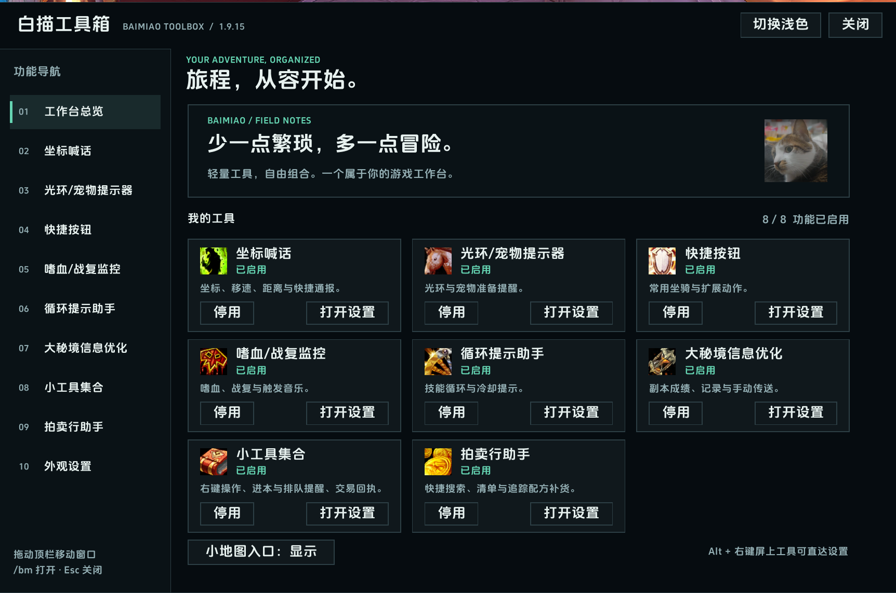
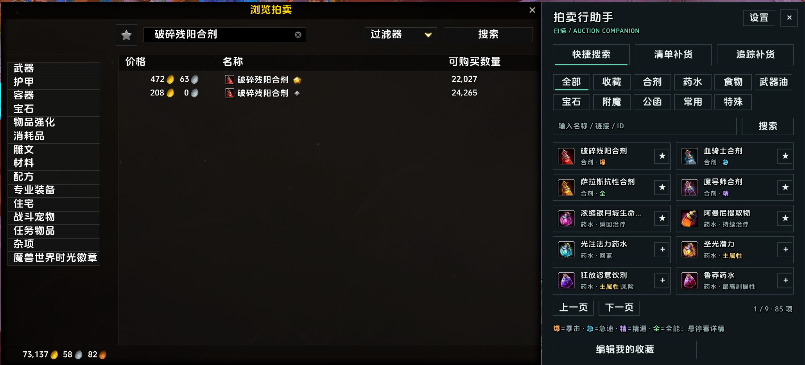
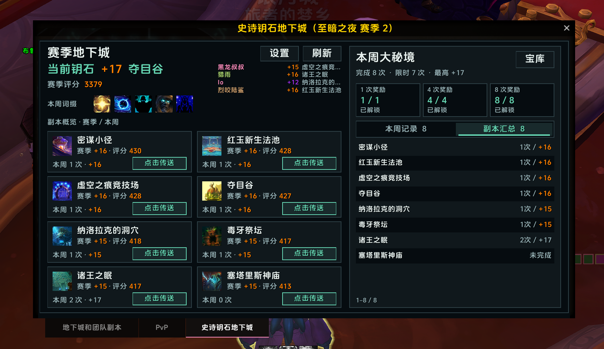

# 白描工具箱 · Baimiao Toolbox
 

面向魔兽世界正式服的模块化工具箱：拍卖行搜索与补货、大秘境信息、日常快捷操作和屏幕提醒，集中在一个工作台，按需启用。 A modular toolkit for WoW Retail: Auction House restocking, Mythic+ information, everyday shortcuts, and reminders.

[下载最新版本](https://github.com/Lianzy-Baimiao/BaimiaoToolbox/releases/latest) · [CurseForge](https://www.curseforge.com/wow/addons/baimiaotoolbox) · [更新日志](CHANGELOG.md) · [完整功能说明 / Description](BaimiaoToolbox_Description.txt) · [问题反馈](https://github.com/Lianzy-Baimiao/BaimiaoToolbox/issues)
**简体中文 / 繁體中文 / English / 한국어**：自动跟随客户端，其他客户端语言回退英文；独立语言文件位于 `Locales/`。支持深浅主题与插件文字轮廓设置，不修改其他插件字体。

## 功能概览
| 功能 | 能做什么 |
| --- | --- |
| **拍卖行助手** | 85 项快捷搜索预设，含合剂、药水、宝石、附魔和公函，支持彩色属性标签与个人收藏；多套补货清单、目标库存、可选限价及预算。面板随原生拍卖行移动、等高显示，并同步缩放、显隐和遮挡顺序。 |
| **追踪配方补货** | 读取制作 / 再造的追踪配方，合并基础材料，可选配方、制作份数及材料品质，默认材料实际最高档；按精确品质扣除背包、银行可见库存与已知邮件。两种补货清单均可逐项搜索。 |
| **史诗钥石地下城** | 赛季成绩、本周记录、副本汇总、宏伟宝库进度、已学会的地城传送，以及队友通过兼容插件或钥石链接分享的钥石。 |
| **快捷按钮** | 五类坐骑及自定义鼠标组合键；玩具、技能、物品和常用动作逐条管理，支持增删与排序。 |
| **状态与日常提醒** | 光环 / 宠物缺失提示、嗜血状态与战复次数、进本难度 / 拾取专精 / 耐久提示、排队就绪提醒及本地交易回执。 |
| **循环提示助手** | 按专精保存技能顺序、单体 / AOE 分支、冷却及方案备注，附惩戒骑预设；仅作被动提醒，不自动施法。 |
| **坐标与团队小工具** | 坐标、移速、目标距离与分享模板；复制角色名、邀请、目标 / 世界标记、就位确认及团队倒数。 |
**设置与诊断：** 设置页按需创建、拍卖行与后台刷新优化、新增可选 /bmperf 诊断。 On-demand settings, targeted refreshes, and opt-in diagnostics. [完整更新 / Changelog](CHANGELOG.md)
## 实机预览
截图展示工作台总览、拍卖行助手与史诗钥石地下城；截图中的版本号和游戏数据可能与当前版本不同。

## 安装与使用
1. 下载 Release 中的 **BaimiaoToolbox-x.y.z.zip**（不要使用自动生成的 Source code 包），将 `BaimiaoToolbox` 文件夹放入 `World of Warcraft/_retail_/Interface/AddOns/`。
2. 更新时完全退出并重启游戏。输入 **`/bm`** 或点击小地图按钮打开工作台，**`/bmah`** 打开拍卖行助手；设置与助手互斥显示。
3. 保留 SavedVariables，无需清空设置。功能配置账号共享，位置与锁定状态按角色保存；切换客户端语言不会改写已有方案名、收藏、搜索词或模板。

**使用边界：**仅支持正式服，无需必装外部插件。拍卖购买仅支持商品类物品，自动查价但每项仍需点击购买；限价 / 预算留空或 0 为不限，报价上涨则不确认，不是无人值守购买。材料品质不保证成品品质，不代选可选材料、火花或货币；普通清单不计银行。队友钥石依赖分享，不能读取他人背包；游戏权限与战斗限制仍然有效。

插件不附带音频，可选音乐需自行配置来源。自有代码采用 [MIT 许可证](LICENSE)；内嵌私有修改版 LibDeflate 保留 [zlib 许可与署名](Libs/KeystoneDeflate.lua)。
