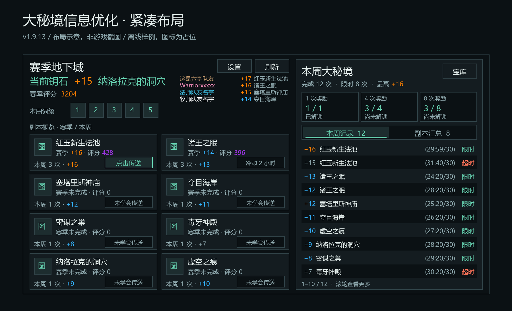
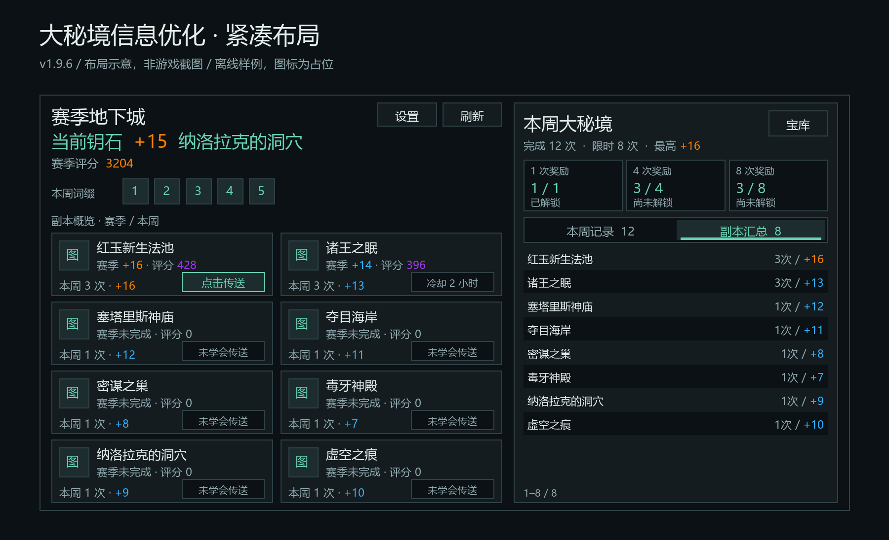
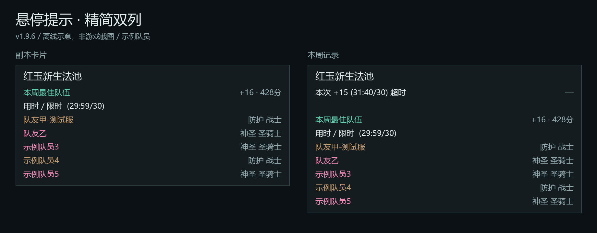

# 大秘境信息优化 · 1.9.13

## 1.9.13 小队钥石姓名修复

“设置 / 刷新”下方默认常驻当前小队另外四名队友的钥石（最多四行），无需入口或展开；不显示自己，不枚举团队。姓名按职业染色，层数 / 副本同行。姓名列从 34 扩为 100 像素，向左利用空位，层数 / 副本列及按钮不动；普通姓名不再显示成“XX…”，超长名称悬停看全名。其他元素位置与窗口尺寸不变，当前钥石 / 评分收窄文字宽度避免重叠，长钥石标题仅在需要时缩小字号（14–18）。

游戏不提供直接读取队友背包钥石的接口；需要兼容插件同步，或由队友在小队频道分享钥石链接。未同步显示“待同步”，不会凭旧最佳成绩猜测持有钥石。详见 [协议、数据边界与检查清单](party-keystones.md)。



## 1.9.9 超时层数颜色

副本概览（赛季 / 本周）、本周记录、副本汇总、本周最高层数及悬停提示中的超时层数统一使用主题暗色。限时仍用游戏层数颜色；当前持有钥石不染成超时色。同一最高层数同时有限时和超时，汇总优先限时；未知用时不误判超时。赛季状态读取赛季最佳用时，不借用本周状态。最佳队伍的取舍规则不变，不为补全名单改选较差的超时记录。


## 使用

1. 已加载 1.9.11 / 1.9.12 覆盖后 /reload 即可；更早版本请完全退出客户端并重新进入，确保加载新增 TOC 文件。
2. 输入 `/bm`，左侧选 **大秘境信息优化**。模块总开关及页面内启用开关均需打开（默认开启）。
3. 点 **打开史诗钥石地下城**，或从游戏系统组队窗口进入同名页签。
4. 卡片右下角 **点击传送** 仅在已学会且冷却就绪时出现。未学会、冷却、未知、关闭与战斗状态保留同位置的状态框，不绑定施法动作（战斗期间由安全条件隐藏按钮，脱战再更新属性）。实际施法条件仍由游戏决定。
5. 右侧使用一体式分段栏切换 **本周记录 / 副本汇总**，带数量和明确选中底色 / 下划线；记录按“用时 / 限时 + 状态”显示，例如 **`(25:24/32) 限时`**。滚轮翻阅超过十条的记录，点击 **宝库** 查看原生奖励详情。
6. 悬停卡片或记录查看跟随鼠标的简洁详情；最佳队伍单独标注，不代表所指向的每一条记录都是这支队伍完成的。传送按钮只显示传送状态。

## 设置组织

| 页签 | 常用设置 |
| --- | --- |
| 显示与布局 | 启用、打开系统页签、显示本周看板、70%–130% 缩放、副本排序 |
| 副本与传送 | 显示赛季最佳、显示评分、手动点击传送、宝库入口 |
| 兼容与刷新 | 隐藏 Kogo 旧本周看板开关、重新请求游戏数据按钮（无说明段落） |

设置页仅保留功能控件和必要分组，不再堆叠说明段落；游戏页脚完全移除，战斗限制只显示在对应传送状态框，不再占用底部空间。

默认窗口为 **840×462**（上一版 840×494），高度进一步减少 32；内容区 820×422，两列八张卡片与十行记录同时可见。顶部“设置”“刷新”并排，间隔 6 像素，保留标题与钥石空间。收紧留白和行高而非简单整体缩放；长副本名在单行内截断，悬停显示全名。

左右区域共用底线，内容底部内边距为 8 像素；可见外框底边内收 8 像素，但独立遮罩仍覆盖原生图标到底部。分段切换保持列表尺寸，重置滚动位置；仅超过十条才显示滚轮提示。

左右跟随工具箱明暗主题。整体尺寸有屏幕大小上限，不修改窗口锚点；在原有 UI 位移较大时，仍可能需要移动游戏窗口或降低缩放。
关闭右侧看板会扩宽副本卡片。关闭模块后恢复进入前的窗口大小和缩放；战斗期间设置与恢复延后到脱战。

## 数据边界

- 成绩只读取**当前角色、当前赛季、本周**数据，不建立跨角色或跨周数据库；小队钥石另接收当前队友分享的持有钥石，仅保存在本次会话缓存。
- 赛季副本列表读取 `C_ChallengeMode.GetMapTable()`；赛季成绩使用玩家评分摘要；钥石、词缀及历史记录来自 `C_MythicPlus`。
- 复制并排序 `GetRunHistory(false, true, true)` 的返回值，不原地修改游戏表。包含超时通关，按层数从高到低排列。
- 限时状态根据 `durationSec` 与地下城限时比较；缺少或受限的时间显示未知，不把未知当失败，也不猜测 `completed` 字段含义。
- 地下城宝库进度读取 `C_WeeklyRewards.GetActivities`。进度可能包含符合条件的英雄 / 史诗地下城，**不必等于大秘境记录次数**；不猜测奖励装等或把其它难度显示成钥石层数。
- 返回空记录时显示本周未完成；API 暂不可用时显示待同步。游戏返回空表但尚未准备好时无法可靠区分；可等待原生更新事件或点击刷新。
- 传送映射是独立维护的挑战模式 ID → 法术 ID 表；包含目前核对过的赛季地图及部分旧地图。后续未知地图仍展示数据，但不生成猜测的施法动作。

## 悬停详情与最佳队伍

- 卡片只显示最佳来源、层数 / 评分、用时 / 限时和队伍名单；传送按钮只显示传送状态，不重复副本 / 队伍详情。
- 使用游戏 `ANCHOR_CURSOR` 锚点跟随鼠标；不增加常驻逐帧脚本。滚动或刷新列表时关闭旧行提示，防止显示上一条记录。
- 本周记录首行显示该次层数、用时 / 限时、限时状态与评分；下方单独标注最佳队伍。缺失时间或评分显示未知 / `—`。
- **直接读取最佳队伍，不逐条匹配历史队友**：本周记录 / 本周副本汇总优先 `GetWeeklyBestForMap`；副本卡片优先从 `GetSeasonBestForMap` 的限时 / 超时最佳中选择评分最高者，同分时选较高层数。缺少首选成绩时用另一来源。
- 如果首选不足两名公开姓名，而另一份最佳有队友姓名，整条回退到另一来源的最佳记录，标题、层数、评分和用时一起切换；不把赛季成绩与本周队员拼成一场不存在的记录。两份都只有本人时注明“仅1人资料”，有匿名队员时注明“姓名不全”。
- 最佳成绩与队伍为独立小节，注明“赛季限时最佳队伍”“赛季超时最佳队伍”或“本周最佳队伍”，显示该最佳成绩的层数、评分、用时及成员姓名 / 职业 / 专精；不显示日期、词缀与重复摘要。
- 名单左侧姓名、右侧专精 / 职业，使用游戏双列提示排版；完整五人名单的卡片提示为 7 行正文，记录提示为 9 行正文（含分隔空行），不计副本标题。
- 队员姓名按职业染色，优先 `C_ClassColor.GetClassColor`，不可用时回退至 `RAID_CLASS_COLORS`；未知 / 受限颜色使用中性文字。仅姓名染色，职业与专精保持柔和的默认提示色，避免颜色延伸至其它字段。
- `GetRunHistory` 不提供队伍名单，因此不把最佳队伍伪装成某一历史记录的实际队友。只在悬停或手动诊断时查询最佳信息，不保存队伍历史，不依赖外部插件；API 未提供名单或返回受限字段时使用明确空态，不编造队友。

## 兼容策略

- 不依赖 EUI 或 AngryKeystones。无论 AngryKeystones 是否启用，使用相同的新内容布局；它的副本计时、进度等其它功能保持不变。
- **不迁移或预测 AngryKeystones 的未来词缀日程**，只显示游戏当前返回的词缀。
- 新的不透明内容层使用 `HIGH` 图层，并高于原生副本图标及其 Kogo 附加点击层；覆盖到内容区底部。只改变本模块的图层，不替换 `ChallengesFrame.Update`，不删除原生 / AK / Kogo 子控件。
- 默认仅临时隐藏全局 `KogoMPlusPanel`。记录它是否显示过；关闭替代或模块时按原页签可见性恢复。不写入 `EllesmereUIPlusAccountDB` 等外部配置。
- Kogo 旧副本标注和点击层位于新面板下面，由新内容层接收鼠标；不会给其它插件安装永久隐藏钩子。若其它版本的 Kogo 改名或提高层级，需要重新适配。
- 传送已学会检测优先使用零售版 `C_SpellBook.IsSpellKnown`，保留旧 API 兼容。就绪按钮使用主题强调色边框；不可用状态使用非安全普通框，状态变化时关闭过期提示，冷却 / 未知状态不保留可点击施法目标。
- 安全传送按钮与新内容层处于相同图层并保持更高层级，独立挂在 `UIParent`，只在非战斗时准备属性；通过安全可见性条件在战斗中隐藏。战斗中首次打开保留原页，脱战后应用新布局。
- 退出时只还原仍由本模块控制的尺寸与缩放；PvP 已经选定的新宽度不会被旧钥石页快照覆盖。
- 原生关闭按钮、其它 PVE 页签、Esc 关闭逻辑保留；不主动加载或弹出大秘境界面。
- 无常驻 `OnUpdate` 或无限轮询；游戏事件合并刷新，请求至少间隔三秒；旧 Kogo 面板延迟创建只进行有界探测。列表行、卡片和安全按钮复用，不随刷新数量增长。

## 层数与评分颜色

- 当前钥石默认采用 18 号字与主题强调色（有队友时长标题按需缩至最小 14 号）；赛季评分不附加来源文字。
- 层数使用 `GetKeystoneLevelRarityColor`，单副本评分使用 `GetSpecificDungeonOverallScoreRarityColor`，总评分使用 `GetDungeonScoreRarityColor`；不把三者混用同一套阈值。
- 游戏颜色按档位划分，并非每个相邻层数必定不同。API 未就绪或返回受限颜色时保留中性文字和原数值，不隐藏数据。

## 离线验证

```shell
python -m unittest discover -s tests -q
python tests/render_mythic_preview.py
```

测试依赖 `lupa`；示意图脚本还需要 Pillow 和中文字体（可传入字体路径）。示意图读取真实模块的部分布局与文本，使用离线夹具和图标占位，**不是游戏截图，也不是 WoW 字体/安全执行环境**。

1.9.8：完整离线测试 **135 项通过**。新增本周/赛季来源选择、单人名单整条回退、匿名/受限姓名、诊断数量，以及嗜血出本/旧疲惫边界；用户诊断已确认本周与赛季限时最佳各返回 1 人、另一场赛季超时最佳返回 5 人；未取得完整原始 API 记录，不能断言游戏一定保留了限时最佳的全部队友。

1.9.6：完整离线测试 **98 项通过**。新增左右底线 / 页脚空间、可见边框与原生遮罩隔离、不可用传送状态 / 技能变化 / 冷却恢复 / 战斗状态框、过期提示清理，以及分段栏选中 / 主题 / 切换 / 滚动回归。保留原生图标 HIGH 图层、PvP 切页顺序、最佳队伍与职业色等原有测试；不等同于通过客户端实测。

覆盖：返回值与空态、只读排序、超时和未知计时、宝库进度、迟加载、开关与还原、AK/Kogo 状态桩、战斗延后、安全属性、翻页/滚动、主题/缩放、重复刷新和反复开关不增长控件。






## 游戏内验收（待人工）

- [ ] 只开 BaimiaoToolbox：原生页签无露底/遮挡，尤其底部不再露出额外 8 个图标；关闭模块还原尺寸。
- [ ] 卡片与记录的姓名 / 专精分列整齐，保留职业色；没有日期、词缀、重复摘要，长角色名没有遮挡。
- [ ] 页面底部无说明留白，左右底线对齐，外框底边完整可见且原生图标不露出。
- [ ] 分段栏选中底色 / 下划线明显，数量正确；反复切换不改变列表尺寸，明暗主题均清晰。
- [ ] 页面和设置中无长说明；战斗限制只在传送状态框显示，不重建页脚。
- [ ] 未学会、冷却、未知、关闭与就绪状态的位置一致；不可用状态不施法，状态变化后旧提示消失。
- [ ] 卡片非按钮区域不提示“点击传送”，移入真正的传送按钮才出现；最佳队伍详情仍正常。
- [ ] 兼容与刷新页只有隐藏旧看板开关和请求数据按钮，操作正常，无大段说明。
- [ ] 顶部设置与刷新并排相邻，显示 / 隐藏本周看板均不遮挡标题和当前钥石。
- [ ] 当前钥石醒目，评分后无来源说明；层数与评分颜色符合游戏档位。
- [ ] 钥石 → PvP → 地下城和团队副本 → 钥石反复切换，背景与内容宽度一致。
- [ ] AK 开启 / 关闭：布局一致；AK 的副本计时与进度仍正常。
- [ ] Kogo 开启：无右侧旧面板、旧传送按钮透穿；关掉本模块后旧内容恢复。
- [ ] 显示 / 隐藏本周看板，明暗主题和缩放后无文字溢出；长副本名在单行内截断，悬停可看全名；八张卡片与十行记录没有互相遮挡。
- [ ] 在卡片、传送按钮、记录、宝库上移动鼠标，提示持续跟随且不挡住操作；滚动后不残留上一行提示。
- [ ] 核对最佳队伍的姓名、职业与专精，以及明确的最佳来源；姓名职业色正确，不影响职业 / 专精的文字色；非最佳历史记录也显示同一最佳队伍，不冒充该次队友。
- [ ] 本周记录的用时 / 限时位于限时、超时之前；缺少时间时显示未知，不与名称、状态挤在一起。
- [ ] 无钥石、无本周记录、未学会传送分别显示正确。
- [ ] 与原生宝库核对进度，与历史记录核对本周次数和最高层数。
- [ ] 已学会且无冷却的传送：左右键行为正确（仅左键施法），按下/抬起配置均只施放一次。
- [ ] 传送冷却中、战斗前后、切换页签、Esc 关闭或关闭模块后，无悬空传送按钮 / 受保护操作报错。
- [ ] 战斗中首次打开、战斗中切换到其它页签、脱战后还原均正常。

## 实现参考

核对日期：2026-10-02。API/FrameXML 参考为 Blizzard UI 源码镜像；实际行为以当前游戏客户端为准。

- [PVEFrame.lua（页签切换顺序）](https://github.com/Gethe/wow-ui-source/blob/live/Interface/AddOns/Blizzard_GroupFinder/Mainline/PVEFrame.lua)
- [Blizzard_ChallengesUI.xml（图标 HIGH 图层）](https://github.com/Gethe/wow-ui-source/blob/live/Interface/AddOns/Blizzard_ChallengesUI/Mainline/Blizzard_ChallengesUI.xml)
- [SpellBookDocumentation.lua](https://github.com/Gethe/wow-ui-source/blob/live/Interface/AddOns/Blizzard_APIDocumentationGenerated/SpellBookDocumentation.lua)
- [Blizzard_ChallengesUI.lua](https://github.com/Gethe/wow-ui-source/blob/live/Interface/AddOns/Blizzard_ChallengesUI/Mainline/Blizzard_ChallengesUI.lua)
- [MythicPlusInfoDocumentation.lua](https://github.com/Gethe/wow-ui-source/blob/live/Interface/AddOns/Blizzard_APIDocumentationGenerated/MythicPlusInfoDocumentation.lua)
- [ChallengeModeInfoDocumentation.lua](https://github.com/Gethe/wow-ui-source/blob/live/Interface/AddOns/Blizzard_APIDocumentationGenerated/ChallengeModeInfoDocumentation.lua)
- [WeeklyRewardsDocumentation.lua](https://github.com/Gethe/wow-ui-source/blob/live/Interface/AddOns/Blizzard_APIDocumentationGenerated/WeeklyRewardsDocumentation.lua)

本地只读核对 AngryKeystones/Schedule.lua 与 EUI_Kogotool/Core/Gameplay 下两个 MPlus 模块的控件归属、命名与传送法术映射；未修改它们，也未加载其它插件的实现代码来提供本模块功能。
## 队伍只有本人时

先悬停要检查的副本卡片或本周记录，再输入 `/bmmp team`。输出当前提示采用哪个最佳来源，以及本周、赛季限时、赛季超时最佳各自公开可读的成员数和有姓名人数；不输出队员姓名、不保存名单、不自动刷屏。

如果本周 5 人而赛季 1 人，插件可以整条选用有队友的本周最佳；如果两份都只有 1 人，刷新可以重新请求数据，但不能保证游戏补回历史姓名，也不能用你现在的小队代替历史队伍。原生 API 契约允许成员 name 缺失，实际返回以客户端为准。


### 1.9.8 已知限制（用户诊断）

密谋小径（587）的本周最佳与赛季限时最佳均只有 1 人 / 1 个姓名，另一场赛季超时最佳有 5 人 / 5 个姓名。本版在该情况下仍采用原本的本周 / 赛季限时最佳，不为凑齐名单改选那场超时记录，也不借其队员补齐限时成绩。限时最佳队员缺失尚未解决；本次发布未包含被撤回的全候选名单回退方案。
