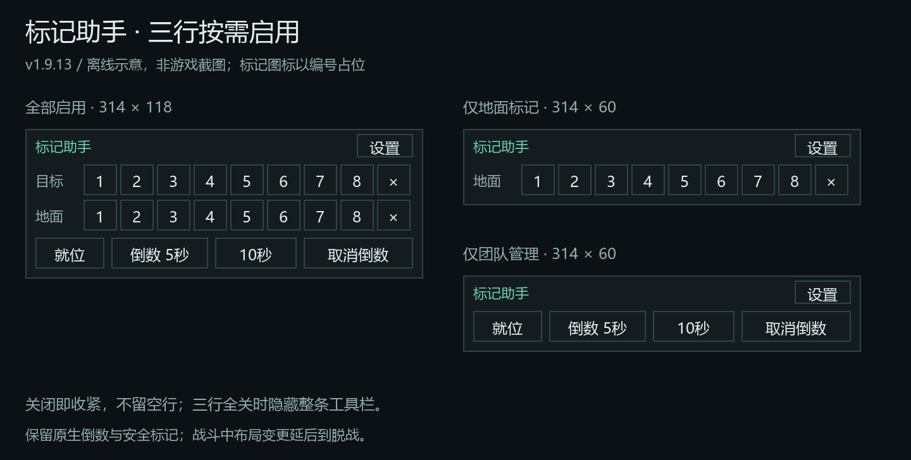

# 小工具集合

入口：`/bm smalltools`，或工作台 → 小工具集合。模块总开关、两个右键子功能和标记助手开关各自独立；默认启用。重新打开右键菜单即可反映邀请开关变化；标记助手默认仅在组队时显示。

## 设置布局

右键菜单两个开关同排；标记助手将目标 / 地面 / 团队管理三个开关并排，组队显示 / 仅队长显示 / 锁定位置并排，缩放与重置位置并排。保留小号 Switch、文字点击和独立设置，窄宽度自动换行。

[坐标喊话与小工具设置离线示意](previews/settings-rows.png)（非游戏截图）。

## 使用

- **公会邀请**：右键玩家、好友、队伍 / 团队成员或聊天玩家，在有邀请权限时显示。战网好友有多个可识别的在线角色时展开角色列表；发送的是选中角色的“名字-服务器”。自身、NPC、已知已入会角色不显示入会动作。
- **选择角色邀请**：战网好友有多个同地区、同版本的在线魔兽角色时显示此子菜单；不取默认在线角色代替你的选择。没有组队权限、队伍已满或跨阵营 / 游戏模式限制时，对应项不可用。单角色时保留暴雪原邀请入口。
- 菜单打开后角色离线、切号、好友列表变化或权限改变，点击会重新检查，不改邀另一个角色。游戏服务器仍负责最终限制和错误提示。
- 不替换暴雪菜单，不自动发送、不批量发送、不添加后台轮询、不保存好友名单。仅支持保留暴雪标准菜单接口的插件组合；第三方完全替换的右键菜单不保证适配。

## 标记助手（1.9.14）

- 三行分别有独立开关：**目标标记、地面标记、团队管理（就位 / 倒数）**。默认全开；隐藏行后自动上移、不留白。三行 314×118，单行 314×60；三行全部关闭时隐藏整条，仍可从工作台恢复。
- 独立小工具条，第一行目标八标，第二行地面八标；使用游戏自带标记图标。**左键设置、右键清除**；每行末尾分别清除当前目标标记 / 全部地面标记。不会自动标怪，不含信号 / ping 系统，不依赖 MRT。
- 底部为就位确认、5 秒、10 秒、取消倒数。倒数调用原生 **C_PartyInfo.DoCountdown**，与游戏团队管理倒数同一路径，不发送 RAID_WARNING 或小队聊天倒数，不转发 DBM / BigWigs / MRT 消息。
- 就位与倒数要求小队队长、团长或团队助理；本工具保守地限制为脱战操作。标记走安全按钮，不给普通玩家提升权限，实际可用场景仍由客户端 / 服务器决定。
- **仅队长显示**：独立开关，默认关闭。开启后只对本人为小队队长 / 团长时显示；团队助理、普通成员、单人均不显示。监听队长转移与队伍变化；战斗中延后脱战应用，不改变原有管理功能权限。
- 设置可关闭标记助手、切换仅组队显示、锁定位置以及 70%–140% 缩放。解锁后拖动标题栏；位置按角色保存。战斗中不创建、移动、缩放或隐藏安全按钮层级，队伍变化 / 关模块等显隐调整延后脱战生效。
- “取消倒数”请求 DoCountdown(0)。公开源码确认倒数接口和返回值，但没有明确文档保证所有场景的 0 秒取消语义；实际取消效果需当前客户端验收。拒绝时只在本机输出简短提示，不尝试聊天替代方案。

## 游戏内验收

1. 完全退出并重进游戏；`/bm` 首页应无需滚动即可看清七个功能，左右导航与底部入口不裁切。
2. 有公会邀请权限的角色右键未入会玩家，点击“公会邀请”后确认收件人；右键自己 / NPC / 已入会目标不出现该动作。无权限角色不出现入口。
3. 一个战网好友同时登录两个正式服角色，右键好友 → 选择角色邀请，分别核对角色名、服务器及收到邀请的角色。跨服可用性以游戏规则为准。
4. 打开菜单后让选中的角色离线 / 换号再点击，不应错邀另一角色；队伍满员、权限变更也不应继续发送。
5. 分别关闭两个子功能，以及关闭模块总开关，重新打开菜单检查；多次开关不出现重复条目。暴雪原邀请等条目仍在。
6. 如其他插件自行重做好友菜单，先在暴雪原生好友列表验证；记录具体入口及是否有 Lua 报错。

7. 组队后显示标记助手，退组后隐藏；取消“仅组队显示”且关闭“仅队长显示”可单人调整位置。开启“仅队长显示”后测试队长转移、团长 / 助理 / 普通成员及单人；只有队长 / 团长可见。测试总开关、子开关、三行的全部八种组合、缩放、拖动及重置；战斗中退组 / 关模块需脱战后隐藏。
8. 分别左键 / 右键八种目标标与地面标，核对顺序与清除范围；测试队长、普通小队成员、团长、助理、普通团员，尤其确认地面标权限。分别测试 ActionButtonUseKeyDown 开关，不应双执行或点不动。
9. 队长点击就位、5 / 10 秒倒数，另一客户端应见原生提示；点击取消检查计时终止。无权限与战斗中不得发送；聊天不应出现倒数刷屏。取消、随机队列与受保护调用仍需游戏实测。

## 实现依据与离线验证

正式服源码参考（2026-10-02 核对）：

- [UnitPopupShared.lua](https://github.com/Gethe/wow-ui-source/blob/live/Interface/AddOns/Blizzard_UnitPopupShared/UnitPopupShared.lua)：标准标签为 MENU_UNIT_ + 菜单类型，contextData 提供 unit、name、server、bnetIDAccount / accountInfo。
- [Menu.lua](https://github.com/Gethe/wow-ui-source/blob/live/Interface/AddOns/Blizzard_Menu/Menu.lua)：Menu.ModifyMenu(tag, callback)，回调签名 owner、rootDescription、contextData。只注册一次；后续开关由回调即时检查。
- [FriendsFrame.lua](https://github.com/Gethe/wow-ui-source/blob/live/Interface/AddOns/Blizzard_FriendsFrame/Mainline/FriendsFrame.lua)：暴雪 Travel Pass 按游戏账号邀请，检查版本、地区、阵营和游戏模式。
- [BattleNetDocumentation.lua](https://github.com/Gethe/wow-ui-source/blob/live/Interface/AddOns/Blizzard_APIDocumentationGenerated/BattleNetDocumentation.lua)：GetFriendNumGameAccounts / GetFriendGameAccountInfo 使用好友**索引**；InviteFriend 使用**游戏账号 ID**。不能把菜单里的战网账号 ID 直接作为这两个参数。
- [GuildInfoDocumentation.lua](https://github.com/Gethe/wow-ui-source/blob/live/Interface/AddOns/Blizzard_APIDocumentationGenerated/GuildInfoDocumentation.lua)：C_GuildInfo.Invite(name)。旧邀请函数仅在命名空间接口缺失时回退。

运行 `python -X utf8 -m unittest discover -s tests -q`。13 项小工具回归执行真实模块与菜单回调，覆盖全名、目标切换、多账号、限制、保密 / 缺失数据、开关以及延迟加载；另有 20 项标记助手回归，当前全项目 217 项通过。测试不会连接或向游戏好友发送邀请，不能替代游戏内的权限 / 受保护调用验证。

团队管理与安全标记的固定提交依据、权限限制和待验证项见 [团队工具 API 核对](party-tools-api.md)。

1.9.14 从已正常加载的 1.9.11 或之后版本更新后 `/reload` 即可；更早版本仍需完全重启客户端。共享设置开关为 26×14，13 号标签及文字点击保留。
